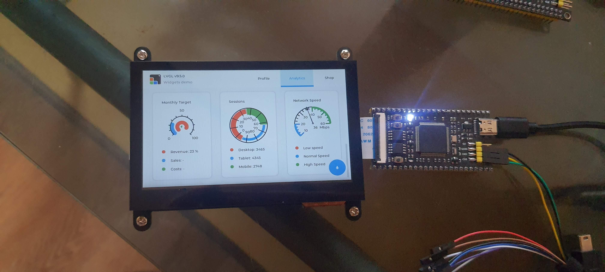

# The Chinese STM32H7B board with LVGL

Yes the board.



## Features
Oh Chinese guys, why did you allocate touch screen pins like this so that we have to use bit banging?  
On next revision, allocate pins for I2C controller.  
That's the only complaint I have.  

## LCD Screen
I'm using aliexpress LCD that supports widlfire/atomic interface.  
The screen size is 4.3 inch. CTP IC is FT5406. Resolution is 800x480.  
It's much cheaper than the aliexpress AT something panels that supports the chinese STM32 LCD inteface.  
No way I'm paying freaking $40 or $50 just for the compatible lcd intefrace.
So a LCD adapter board was created with KiCad. It's cheap to order from JLCPCB and  
easy to solder if you have some skills and soldering equipments.  


There is another adapter board that supports LCD blacklight power directly but work is in progress and parts are still on the way from aliexpress.  

If you are interested, just check the kicad folder.  

## How to Build and Flash

### 1. Clone the Repository
Pull the project and automatically download the pinned LVGL v9.5.0 submodule package:
```bash
git clone --recursive https://github.com/peakhunt/FK7B0M1-VBT6-FREERTOS
cd FK7B0M1-VBT6-FREERTOS
```

### 2. Compile
```bash
make clean
make -j$(nproc)
```

### 3. Flash the Board
Wipes the chip and forces `st-flash` to write past the default 128 KB factory threshold:
```bash
make stflash
```
